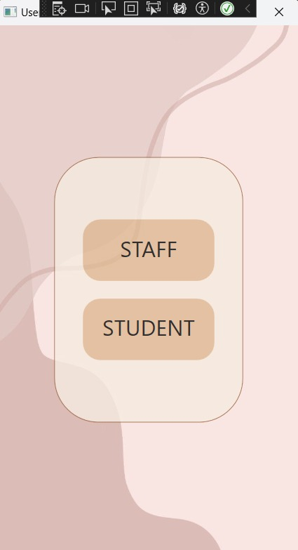
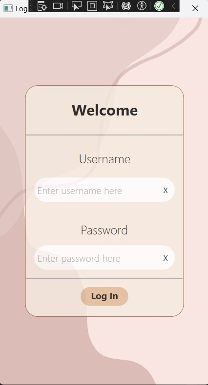

## Phase 3 Implementation and Testing

## Content

[**Introduction**](#1-introduction)

[**Table**](#2-table)

[**Implementation**](#3-implementation)

 * [Login Page](##31-login-page)

 * [Student and Staff Home Page](##32-student-and-staff-home-page)

 * [Balance management and payment](#33-balance-managment-and-payment-page)

 * [Renting the books and journals](#34-renting-the-books-and-journals)
   
[**Testing**](#4-testing)

[**Conclusion**](#5-conculusion)

## 1. Introduction

Phase 3 marks a pivotal stage in our project's development lifecycle, where we transition from design concepts to tangible software solutions. This phase focuses on the meticulous implementation of our system using the C# programming language, coupled with rigorous testing procedures to ensure functionality and reliability.

The adoption of C# as our primary programming language underscores our commitment to leveraging robust tools for software development. Its extensive features and strong typing system provide a solid foundation for translating our design specifications into executable code.

Testing stands as an indispensable aspect of this phase, serving as a critical quality assurance mechanism. Through systematic testing strategies, encompassing unit testing, integration testing, and possibly other methodologies, we aim to validate our software's adherence to specified requirements and its ability to operate seamlessly under diverse conditions.

Central to our workflow is the structured utilization of Git, facilitating collaborative development while maintaining version control integrity. By adhering to branching conventions and merging protocols, we ensure the orderly progression of our development efforts, with all code changes ultimately consolidated into the designated 'phase/3' branch.

To document our progress and facilitate comprehensive understanding, a README.md file will serve as a repository for vital project information. Task assignments, implementation insights, testing methodologies, and outcomes will be systematically documented, providing a clear and informative narrative of our activities during Phase 3

## 2. Table
 
| Team Member | Student ID | University Email | GitHub Username | Allocated Tasks |
|----------|----------|----------|----------|----------|
| **Pelit**, Zeynep | 001221738 | zp9906d@gre.ac.uk | [turko06](https://github.com/turko06) | Table , Login Page, GitHub Flow  |
| **Patel**, Saumya | 001257508 | sp0675d@gre.ac.uk | [SamEng001](https://github.com/SamEng001) |   Student Page |
| **Rusnac**, Nicoleta | 001143379 | nr1227e@gre.ac.uk | [nicoletarusnac](https://github.com/nicoletarusnac) | Payment Page, Student and Staff management |, | Conclusion  |
| **Fashola**, Oba | 001272516 | of1104h@gre.ac.uk | [GeneralDavid9797](https://github.com/GeneralDavid9797) | Staff and Student Renting book and journal page, Late Penalty |,  
| **Abdullah**, Ali | 001258128 | aa4759n@gre.ac.uk | [Ali-Abdullah786](https://github.com/Ali-Abdullah786) | Staff Home Page|, |   |

## 3. Implementation 

### 3.1 Login Page

    
When people first log in to the app this page going to welcome them asking if they are student or staff once they choose one it will take them to the Login page where they can enter their login details. 

 

### 3.2 Student and Staff Home Page 

### 3.3 Balance management and payment page 

### 3.4 Renting the books and journals 

## 4. Testing 

### 5. Conclusion 

