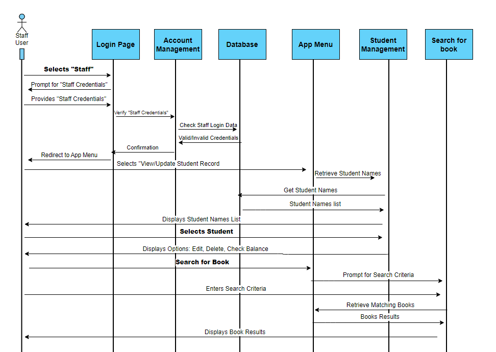
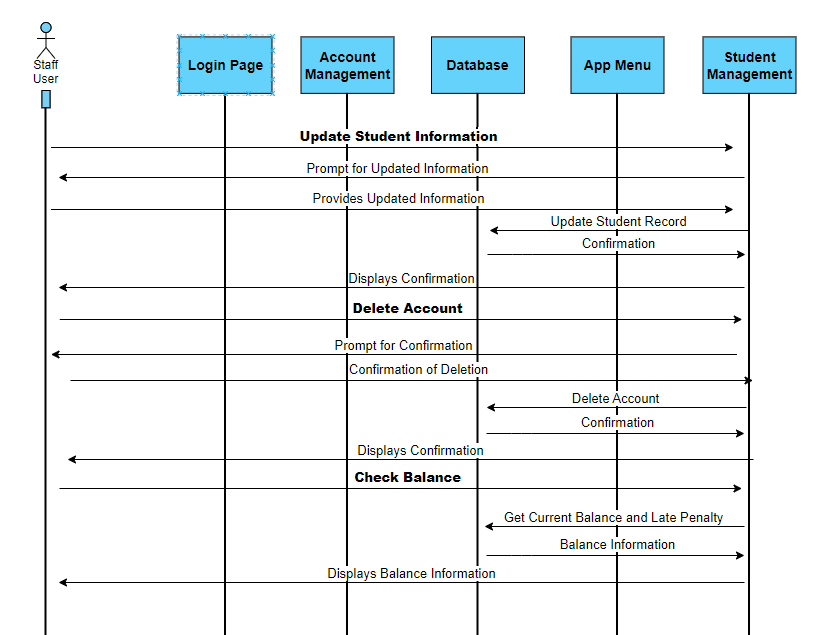
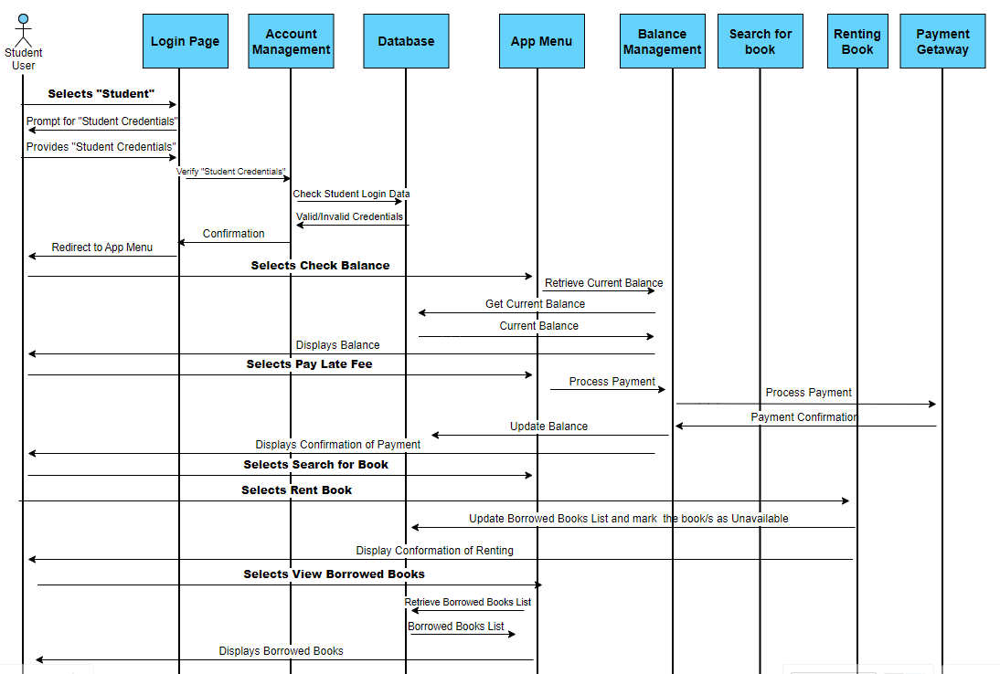
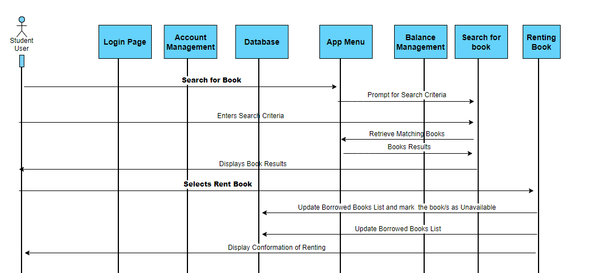

# Phase 2- System Modelling and Design Phase
## Content
- **Introduction**

- **Table**

- **Overall Architecture of the System**

- **Use case Diagram**

- **Sequence Diagram**

- **Class Diagram**

- **Activity Diagram**

- **State Chart Diagram**

- **Reference**

- **Gantt Chart**

- **Appendices**

## Introduction

## Table

| Team Member | Student ID | University Email | GitHub Username | Allocated Tasks |
|----------|----------|----------|----------|----------|
| **Pelit**, Zeynep | 001221738 | zp9906d@gre.ac.uk | [turko06](https://github.com/turko06) | Table , Activity Diagram  |
| **Patel**, Saumya | 001257508 | sp0675d@gre.ac.uk | [SamEng001](https://github.com/SamEng001) |   Use Case Diagram, Content Table, Overall Architecture of the System  |
| **Rusnac**, Nicoleta | 001143379 | nr1227e@gre.ac.uk | [nicoletarusnac](https://github.com/nicoletarusnac) | Sequence Diagram |, | Conculusion  |
| **Fashola**, Oba | 001272516 | of1104h@gre.ac.uk | [GeneralDavid9797](https://github.com/GeneralDavid9797) | Introduction, State Chart Diagram, Overall Architecture of the System |, | State Chart Diagram 
| **Abdullah**, Ali | 001258128 | aa4759n@gre.ac.uk | [Ali-Abdullah786](https://github.com/Ali-Abdullah786) | Class Diagram, Gantt Chart |, |   |

## Overall Architecture of the System

## Use case diagram

In software development, a use case diagram is a graphic representation that shows how system actors interact with the system. By depicting a system's use cases and the roles that interact with them, it encapsulates the dynamic behaviour of the system. [[5]](#5)

### Tabular description:

| Actor | Student |
|-------|---------|
Description | Student can login in their account, Student can check account, Student can check balance, Student can payoff late fee, Student can search books, Student can rent books. 
Data | Login details of student (username and password), Search history, Rented books history, Late fee days + 10p each day. 
Stimulus | Entering invalid login credentials,  Trying to rent a book that is not available
Response | Displaying appropriate error messages for invalid login attempts, Notifying if a requested book is unavailable for rent, Payment successful, Rented successful 
Comments | Validate and sanitize user inputs to prevent potential security vulnerabilities.
----
| Actor | Staff |
|-------|-------|
Description | Staff can login in their account, check their account as well as students account, check student balance, search books, rent books for student, payoff late fee, delete any student’s account. 
Data | Login details of staff (username and password), Search history, Rented books list of any student, Late fee days + 10p each day of all students, Financial log, Inventory (Id. number of for each book, Title of books, ISBN no., Author, Synopsis, Picture of book, Journal title, paper title, volume number, date)
Stimulus | Entering invalid login credentials,  Trying to rent a book that is not available, Trying to delete a student account with outstanding late fees. 
Response | Preventing the deletion of a student account with outstanding late fees, Disply popup before deleting student account, Validating book details to avoid errors during the rental process, Payment successful, Rented successful. 
Comments | Ensure proper handling of financial transactions for balance updates, Consider implementing a confirmation step for critical actions like account deletion.

## Sequence Diagram
### Sequence Diagram Definition
Sequence diagram is a Behavioral Unified Modeling Language (ULM) that is used to show the interactions of the active objects  of the system in a sequential order of them occuring. [[1]](#1) They show the sequence in which interactions take place by showing specific objects, referred to as lifelines, and the messages that flow between them. These diagrams may be used to map out the timing of interactions at various phases of the development process and are useful forsystem design, testing, and maintenance. [[2]](#2) 
### Constructing Sequence Diagrams
Sequence diagrams are usually created following a few steps:
1.	First is identifying the actors/objects: which are all the entities involved in a system. They are defined in the diagram on top wrapped in a rectangle. They are interacting between them with arrows that show the flow of communication and with messages which are shown on top of the arrows. In case of an online library system the following can be objects: user, library system, book database, account database. 
2.	Second step is stipulating the Use Cases which are the main features of the system such as: book searching, book borrowing, book renewing, paying the fines etc.
3.	Third step is defining the interactions: which are the actions/communication between the objects and use cases. In our case it can be a user requesting a book, library system updating user’s records etc.
4.	Fourth step is drawing separate Use cases diagrams with detailed flow of communication and precise messages. 
5.	Fifth step is combining the Use cases diagrams if possible in a detailed and understandable way. [[3]](#3) [[4]](#4)

### Sequence Diagrams for the Library System
#### Staff User Login and Interactions
<u>Actors/Objects</u>: Staff user, Login Page, Account Management, Database, App menu, Student Management, Search for Book.

<u>Interactions</u>:
1.  Staff User picks "Staff" from the first screen.
2.	The Login Page requests for staff credentials.
3.	Staff User inputs their credentials.
4.	The Login Page validates credentials with Account Management (interacting with Database).
5.	Account Management and Database validates credentials and delivers a confirmation to the Login Page.
6.	The Login Page links to the App Menu.
7.	Staff User chooses options from the App Menu:

* Student management:
    * Selects "View/Update Student Record".
    * The system presents the "Select Student" page, which contains student names retrieving it from the Database.
    * The Staff User selects a student.
    * The system provides tools for editing, deleting, and checking the balance.
    * Staff User selects an option:
        * Check Balance: The system displays the current balance and late penalty retrieving it from the Database.
        * Edit Student Account: The system prompts for new information and saves the changes to the Database, and updates student record.
        * Delete Student Account: The system requests for confirmation and then deletes the account from the Database, and removes the student record.
* Search for book:  Staff User enters search criteria, the system retrieves matching books from the Database and display books that fit those criteria.

General Staff User Login and Interactions and Detailed Student Account Management Sequence Diagrams can be found in Appendix.
#### Student User Login and Interactions
<u>Actors/Objects</u>: Student User, Login Page, Account Management, App Menu, Balance Management,  Payment Getaway, Renting a book, Search for book, Database.

<u>Interactions</u>:
1.	On the first screen, the Student User selects "Student".
2.	The Login Page requests for student credentials.
3.	Student User inputs their credentials.
4.	The Login Page validates credentials with Account Management (interacting with the Database).
5.	Account Management and the Database validates credentials and delivers a confirmation to the Login Page.
6.	Student User picks an option from the App Menu:
    * Balance Management:
        * Selects "Check Balance": the system displays the current balance from the Database.
        * Selects "Pay Late Fee": the system requests for payment details and processes the payment interacting with the Payment Getaway, then updates the balance in the Database, and send a confirmation message to the Student User.
    * Renting Book:
        * Selects “Search for Book”: the system will provide a search interface where students can input criteria, in return the system retrieves matching books from the Database and show the results.
        * Selects “Rent Book”: the system asks for a confirmation from the user and updates the student’s borrowed books list in the Database, labels the book as unavailable, and sends a confirmation message to the user.
        * Selects “View Borrowed Books”: the system retrieves and show a list of borrowed books from the Database.

General Student User Login and Interactions and Detailed Student Search for Book and Rent Sequence Diagrams can be found in Appendix. 

## Class Diagram

## Activity Diagram 

[[7]](#7), [[8]](#8), [[9]](#9) An activity diagram, classified as a UML diagram, serves the purpose of illustrating the sequential flow of activities within a given process. Business analysts leverage activity diagrams for the analysis of changes in business processes, depiction of workflows, and modeling intricate algorithms using UML. Through a meticulous examination of business processes via activity diagrams, it becomes possible to identify and streamline sequential operations that could be executed in parallel. 

Use cases, offering a textual elucidation of the business process, may necessitate support from activity diagrams, particularly when intricate interconnections between flows arise. Consequently, activity diagrams serve as valuable input for systemic design and testing processes. The workflow specified in the activity diagram facilitates the creation of detailed system designs and test scenarios. 

A paramount characteristic distinguishing activity diagrams from flowcharts lies in their support for parallel behavior. When aiming to represent the algorithmic logic of multithreaded applications using UML, employing activity diagrams proves to be apt. 

It is essential to note that the depiction of activities in parallel within activity diagrams does not imply that these activities must be performed simultaneously. Rather, this notation signifies the absence of a predetermined order relationship among the activities. 

### Tabular description of staff account:

| Action | Description |
|-------|-------|
Log in  | Staff members are required to input their respective email addresses and passwords to access their accounts. Upon successful login, they will gain comprehensive access to all system functionalities. 
Delete an account  | Staff will be able to delete student accounts. However, a confirmation pop-up will prompt, ensuring that the staff member is certain about the deletion action. 
Late Penalty |Staff should be able to manage the late penalties for students and pay them off. 
View Balance | Staff are granted the privilege to view the account balances of students, providing a comprehensive overview of financial information. 
Book look ups | Staff members can conduct thorough book searches, obtaining information on the availability of books within the system. This feature allows staff to efficiently manage and monitor the status of each book in the inventory. 

### Tabular description of student account:

| Action | Description |
|-------|-------|
Log in  | Students are required to input their respective email addresses and passwords to access their accounts. Upon successful login, they will gain comprehensive access to all system functionalities. 
Renting book  |  Students will be able to choose a book and rent the book for 3 days, 7 days, and 14 days.  
Renting Journals | Student will be able choose Journals and rent the. Journals for 3 days, 7 days, and 14 days. 
 Borrowed Journals and Book | Students can view their rental history, displaying details such as the books and journals they have borrowed, the rental durations, return status, and any overdue items. This comprehensive view will facilitate a better understanding of their borrowing history. 

## State Chart Diagram

## References
<a id="1">[1]</a> 
Visual Paradigm. What is sequence diagram? Learn UML Faster, Better and Easier.  Available at:https://www.visual-paradigm.com/guide/uml-unified-modeling-language/what-is-sequence-diagram/ 

<a id="2">[2]</a> Bell, D. (2023) Explore the UML sequence diagram, IBM developer. Available at: https://developer.ibm.com/articles/the-sequence-diagram/

<a id="3">[3]</a> Creately.com. (2022). Sequence Diagram Tutorial – Complete Guide with Examples | Creately. Available at: https://creately.com/guides/sequence-diagram-tutorial/

<a id="2">[2]</a> Bell, D. (2023) Explore the UML sequence diagram, IBM developer. Available at: https://developer.ibm.com/articles/the-sequence-diagram/

<a id="3">[3]</a> Creately.com. (2022). Sequence Diagram Tutorial – Complete Guide with Examples | Creately. Available at: https://creately.com/guides/sequence-diagram-tutorial/

<a id="4">[4]</a> Lucidchart. (2019). How to Draw a Sequence Diagram in UML Available at: https://www.lucidchart.com/pages/how-to-draw-a-sequence-diagram-in-UML 

<a id="5">[5]</a> PlantUML.com. (n.d.). Use case Diagram syntax and features. [online] Available at: https://plantuml.com/use-case-diagram.
‌

<a id="6">[6]</a> BoardMix. (n.d.). What Is Activity Diagram. [online] Available at: https://boardmix.com/tips/uml-activity-diagram/.

‌<a id="7">[7]</a> Visual Paradigm (2019). What is Activity Diagram? [online] Visual-paradigm.com. Available at: https://www.visual-paradigm.com/guide/uml-unified-modeling-language/what-is-activity-diagram/. 

<a id="8">[8]</a> www.mindmanager.com. (n.d.). What is an Activity Diagram? | MindManager. [online] Available at: https://www.mindmanager.com/en/features/activity-diagram/. 

‌<a id="9">[9]</a> tutorialspoint.com (2019). UML - Activity Diagrams. [online] www.tutorialspoint.com. Available at: https://www.tutorialspoint.com/uml/uml_activity_diagram.htm. 

‌ 

## Appendices

 Use Case Diagrams 

 Sequence Diagrams 

General Staff User Login and Interactions Sequence Diagram
 

  Detailed Student Account Management Sequence  Diagram 

  General Student User Login and Interactions Sequence Diagram 
  

 Detailed Student Search for Book and Rent Sequence Diagram 

 Class Diagram 

 Activity Diagram 

## Components and Notations of UML Activity Diagram

[[6]](#6)

 State Chart Diagram 

